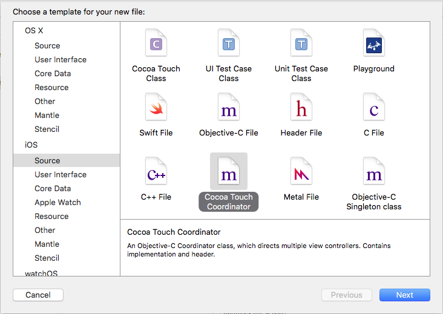

## What is this?

An Xcode File Template that creates an Objective-C Coordinator class. It is for both iOS and OS X. Inspired by a really good reading by Soroush Khanlou ([Github](https://github.com/khanlou), [Twitter](http://www.twitter.com/khanlou)) about [Coordinators Redux](http://khanlou.com/2015/10/coordinators-redux/) I created this Xcode file template.


## Installation

This repository contains an `install.h` shell script. You should give it execution rights with:

```Shell
$ chmod +x install.sh
```

before exute it with:

```Shell
$ ./install.sh
```

The Coordinator template will be installed under `~/Library/Developer/Xcode/Templates/File Templates/Source/`. Regarding the last path component `Source/` you'll find it in Xcode under the related category `Source` for both iOS and OS X.




## Note

In order to let the coordinator class work properly on Mac OS X, you need a navigation controller. Mac OS X doesn't support such a class. So, you might have a look to another open source software project of mine on Github: [CCNNavigationController](https://github.com/phranck/CCNNavigationController).


## Xcode Template Ressources

* There is a [very good article](Creating Custom Xcode 4 File Templates) which describes how to create your own Xcode file templates with **lots** of insights about the quite undocumented keys and variables used in the `TemplateInfo.plist`.


## Contribution

The code is provided as-is, and it is far off being complete or free of bugs. If you like this component feel free to support it. Make changes related to your needs, extend it or just use it in your own project. Pull-Requests and Feedbacks are very welcome. Just contact me at [phranck@cocoanaut.com](mailto:phranck@cocoanaut.com?Subject=[Xcode-Coordinator-Template] Your component on Github) or send me a ping on Twitter [@TheCocoaNaut](http://twitter.com/TheCocoaNaut). 


## License
This software is published under the [MIT License](http://cocoanaut.mit-license.org).
